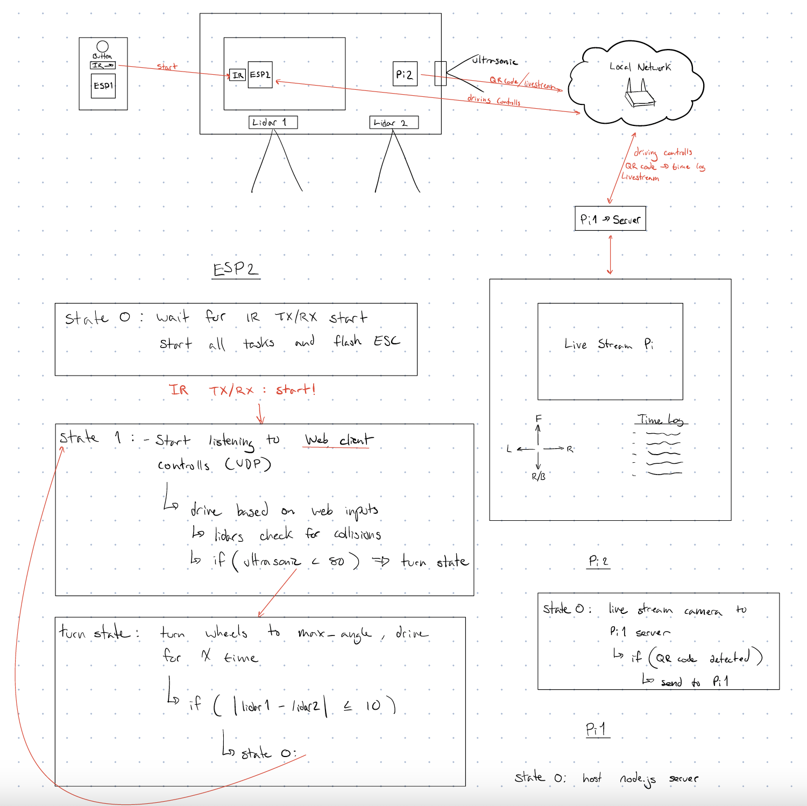

# Rally

Authors: Marybel Boujaoude, Hassan Hijazi, Nicholas Hardy, Riya Deokar

Date: 2023-05-02

### Summary

Design Pattern

This quest involves designing and building a remote-controlled car that can navigate through a course with several checkpoints, logging time and distance, and arriving at the finish line. The car is controlled via a web interface that includes steering, speed, and stop controls. The elapsed time between checkpoints is recorded and saved to a Raspberry Pi-hosted database, and there are preset queries to generate a summary of checkpoint times. The car has range sensors for collision avoidance, and a PID controller maintains a constant speed between checkpoints. QR codes are used to trigger the start of the race and to identify each checkpoint, and an alpha display shows the most recent split time. The car must be controlled remotely and avoid collisions with objects on the course. The goal is to complete the course without nudges or touches, and a green light signal or QR code flashed on a laptop can be used to start the course.

### Self-Assessment 

| Objective Criterion | Rating | Max Value  | 
|---------------------------------------------|:-----------:|:---------:|
| Objective One | 1 |  1     | 
| Objective Two | 1 |  1     | 
| Objective Three | 1 |  1     | 
| Objective Four | 1 |  1     | 
| Objective Five | 1 |  1     | 
| Objective Six | 1 |  1     | 
| Objective Seven | 1 |  1     | 

### Solution Design

We designed a solution for a rally race course. Our goal was to send a car through a course with checkpoints, logging time and distance, and arriving at a finish line. The components of the quest included a web interface, a buggy with range sensors, an IR receiver, an alpha display, and a QR code decoder.

To meet the requirements of the quest, we had to design and build a solution that integrated these components. We needed to control the car through a web interface, with controls for left, right, forward, stop, and speed setpoint. We also needed to incorporate video from the car in a single browser frame with driving controls.

We had to design a client web interface to query for transit time history and ensure that the car was driven remotely from a URL and drove successfully, including L, R, F, R, stop controls. We had to visit each QR code checkpoint and decode it in the program, logging it. We also needed to ensure that after a collision stop, the car could restart in reverse to reset.

We implemented PID control for constant speed between checkpoints and started the course with a QR code flashed on a laptop from "R" to "G." We ensured that range sensors were functional and prevented collisions, and that there were no collisions with any objects on the course. We displayed the most recent average transit time on the alpha display and completed the course using remote control without nudges or touches.

We have included a higher quality video for sharing, and demonstrating our solution.

1st Design Schematic (final replaces IR/TX and adds second pi cam)

### Sketches/Diagrams

Web Browser

Rally Course

Sketch

### Supporting Artifacts
- [Link to video technical presentation](https://drive.google.com/file/d/1p83heObXq9DYXU78tu1gfZx_JFn7m9QY/view?usp=sharing)
- [Link to video demo](https://drive.google.com/file/d/10k-IGMbjfVYvtW3FPQGPIcMwyFa6g_xL/view?usp=sharing)

### Modules, Tools, Source Used Including Attribution
HUZZAH32 ESP32 Feather Board, Raspberry Pi, Raspberry Pi Camera V2, QRD1114 Optical Detector, IP Address, E1200 V2 Router, UDP, LIDAR-lite V3, ESC, Servo, Buggy, Adafruit 14-Segment Alphanumeric LED, Ultrasonic Sensor, Node.js, python, TingoDB

### References
Calibration https://github.com/BU-EC444/01-EBook/blob/main/docs/briefs/recipes/recipe-esc-buggy.md https://github.com/BU-EC444/01-EBook/blob/main/docs/briefs/recipes/recipe-buggy-interfacing.md

Servo https://github.com/espressif/esp-idf/tree/master/examples/peripherals/mcpwm/mcpwm_servo_control

MCPWM https://docs.espressif.com/projects/esp-idf/en/latest/esp32/api-reference/peripherals/mcpwm.html

PID https://github.com/BU-EC444/01-EBook/blob/main/docs/briefs/design-patterns/dp-pid.md

TingoDB http://www.tingodb.com/

Node.js https://www.w3schools.com/nodejs/nodejs_mongodb.asp

UDP https://github.com/espressif/esp-idf/tree/master/examples/protocols/sockets/udp_server 

Pi Cam https://github.com/BU-EC444/01-EBook/blob/main/docs/briefs/recipes/recipe-picam2.md

Router http://freshtomato.org/ 

Wifi https://github.com/BU-EC444/01-EBook/blob/main/docs/utilities/docs/wifi-channels.md
